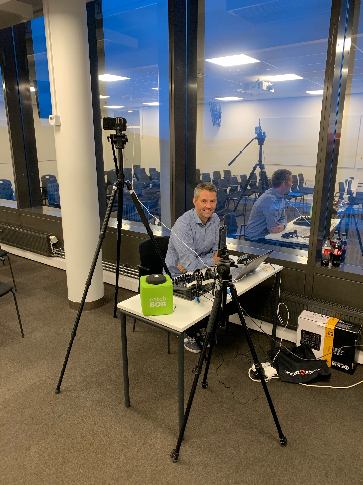
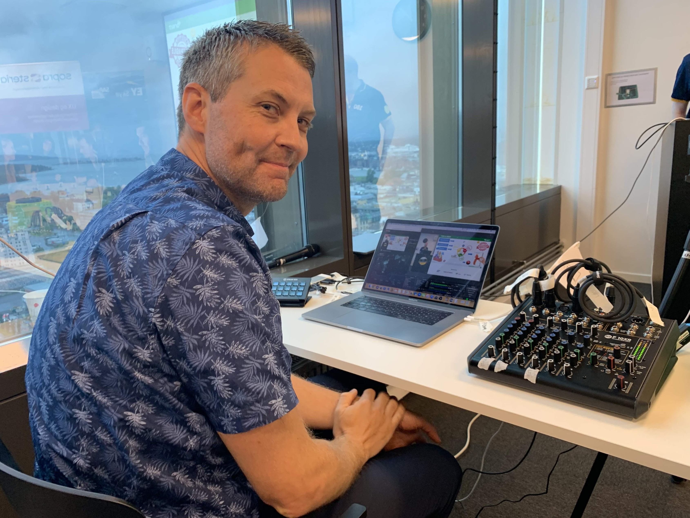

# SAP TechEd 2019 - Unleash the power of sharing - Bootstrapping a local SAP community

This document contain links to various resources, supporting my talk ([CT152](https://sessioncatalog.sapevents.com/go/agendabuilder.sessions/?l=221&sid=98352_508694&locale=en_US))on how you can become an active member of the SAP Community, and organize a community event like SAP Inside Track.

## General SAP Community
* [SAP Community](https://community.sap.com/) - SAP Community landing page
* [SAP Blogs](https://blogs.sap.com/) - Blog on SAP Community
* [SAP Answers](https://answers.sap.com) - Ask question conserning SAP tech, and help other people in the community
* [SAP Community events](https://community.sap.com/events) - Find out about different SAP Community events

## Information SAP Inside Track
* [SAP Inside Track Wiki](https://wiki.scn.sap.com/wiki/display/events/SAP+Inside+Track) - Listing of SAP Inside Tracks
* [How to host a SIT event](https://community.sap.com/events/inside-track/about-inside-track) - How-to guide
* [Coffee Corner Radio Podcast](https://anchor.fm/sap-community-podcast)
   * Episode 3: Interview with Craig Cmehil - This episode brings you an interview with Craig Cmehil, who is the new head of the SAP community and Mentor program.
     * [Link to episode on Overcast](https://overcast.fm/+MsUr0KsXc)
     * [Link to episode on Apple Podcast](https://podcasts.apple.com/no/podcast/episode-3-interview-with-craig-cmehil/id1370422791?i=1000412626586&l=nb)
     * [Link to episode on Breaker](https://www.breaker.audio/coffee-corner-radio/e/34354403)
     * [Link to episode on Spotify](https://open.spotify.com/episode/617dAjTFNHy7kpzS9OzkAM)
    * Episode 11: SAP Inside Track (SIT) Council with Svea Becker - In this episode Simon chats with Svea Becker - SAP Community Advocate for SAP Community Events. They discuss SAP Inside Tracks, Stammtisch and the new SIT Council.
      * [Link to episode on Overcast](https://overcast.fm/+MsUpeT6Mw)
      * [Link to episode on Apple Podcast](https://podcasts.apple.com/no/podcast/episode-11-sap-inside-track-sit-council-with-svea-becker/id1370422791?i=1000424110471&l=nb)
      * [Link to episode on Breaker](https://www.breaker.audio/coffee-corner-radio/e/40150452)
      * [Link to episode on Spotify](https://open.spotify.com/episode/7z6QIMFuM12BOjmKL6wo3e)

## Tools
* [Trello](https://trello.com) - Project management
* [Google Docs(Docs, Sheets, Forms)](https://docs.google.com) - Collaboration tools
* [Eventbrite](https://www.eventbrite.co.uk) - Event management, tickets and registrations
* [bit.ly](https://bitly.com/) - Link management
* [Wheel of Names](https://wheelofnames.com) - For SAP Press book raffle
* [YouTube](https://www.youtube.com/) - Streaming
* [Twitter](https://twitter.com/) - Promotion 
* [Facebook](https://www.facebook.com/) - Promotion - (Streaming alternative)
* [LinkedIn](https://www.linkedin.com) - Promotion

## On streaming
* [SAP Community Events Live Streaming Howto](https://wiki.scn.sap.com/wiki/display/events/SAP+Community+Events+Live+Streaming+Howto)
* [Live Streaming SAP Inside Tracks by Oliver Kohl](https://www.slideshare.net/OliverKohl/live-streaming-sap-inside-tracks)

## Some YouTube Channels 
* [SAP Inside Track Oslo](https://www.youtube.com/channel/UCKrvB41_qXW5bAhSgk_a4WA)
* [SAP Inside Track Berlin](https://www.youtube.com/channel/UCIFc5qs0jm9__cEZBZxDM3w)
* [SITBCN SAP Insider Track Barcelona](https://www.youtube.com/channel/UCXWEDcgGgo_Fe9rgP6argdA)
* [SAP Inside Track Vienna](https://www.youtube.com/channel/UCxyJaGyCTPyYfctQLeP3D6w)
* [SAP Inside Track Netherlands #sitNL](https://www.youtube.com/channel/UCJPTuPbBxH)
* [SAP Inside Track sitPOTT](https://www.youtube.com/channel/UCuquqxaHNQhdi2cfaFcqtkw)
* [SIT Brasil](https://www.youtube.com/user/sitbrasil/videos)
* [SAP Inside Track Silicon Valley SITsv](https://www.youtube.com/channel/UCKUHLxQ9ADXC2rsBzxrzyog)
* [SAP Community Turkey](https://www.youtube.com/channel/UCeXTugjVw1g1fJcHcT7KMzA)
* [SAP Stammtisch München](https://www.youtube.com/channel/UCG-Q32DRyzDw190jgyT5wHA)

## Streaming setup SAP Inside Track Oslo 2019
* MacBook Pro 15" 2017 - dedicated streaming computer
   * [Open Broadcaster Software(OBS)](https://obsproject.com/) - Open source software for video recording and live streaming
   * [OBS Link](https://help.elgato.com/hc/en-us/articles/360031363132-OBS-Link-Setup) - (Mac only) Utility for linking Elgato Game Capture HD60S to OBS
   * [Apple Keynote](https://www.apple.com/keynote/) - For creating title screens for stream
   * [Google Chrome](https://www.google.com/intl/no/chrome/) - For managing sitOSLO channel on YouTube.
* [Belkin USB 3.0 4 Port Hub](https://www.belkin.com/us/p/P-F4U088/) - Powered USB C hub, for robust connectivity on MacBook Pro
* [Elgato Game Capture HD60S](https://www.elgato.com/en/gaming/game-capture-hd60-s) - Capture device to capture presentation over HDMI. Hooks between presenter computer and projector.
* [Elgato Stream Deck](https://www.elgato.com/en/gaming/stream-deck) - USB controller for scene transitions
* iPhone 7 Plus - dedicated camera for stream
* iPhone Xs MAX - dedicated camera for stream
  * [Camera for OBS Studio](https://obs.camera/) - Camera app running on both phones, that links with OBS on the computer
* [Sennheiser AVX-ME2 set](https://no-no.sennheiser.com/avx-me2-set) - Wireless microphone for presenters.
* [Catchbox](https://catchbox.com/) - Padded microphone, for audience audio capture during Q&A.
* [RCF F 10XR](https://www.thomannmusic.no/rcf_f_10_xr.htm) - Mixer and USB audio interface
* Unknown tripods, with phone mounts

